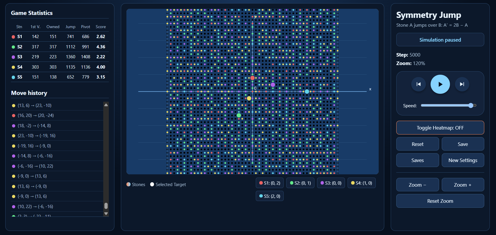

# Symmetry Jump Environment

> A machine learning environment and simulator for infinite grid parity jump puzzles (inspired by concepts like Conway's Soldiers and Peg Solitaire).

**Topics:** `combinatorial-game-theory`, `invariant-theory`, `parity-arguments`, `discrete-mathematics`, `machine-learning`, `reinforcement-learning`, `simulation`

---

## 📖 Introduction
Symmetry Jump is an interactive, high-performance web-based simulation and AI environment. It models a mathematical system where points (stones) move through a 2D space using **point reflection (symmetry)**. 

Currently serving as an ultra-fast mathematical biome and visualization tool, the project is actively being structured to evolve into a fully-fledged Machine Learning environment for training intelligent agents.

## 🧮 The Mathematics (Invariant & Parity)
The core of this environment is built on strict mathematical constraints:
* **The Jump (Point Reflection):** When Stone A jumps over Stone B, it reflects across B as its center of symmetry. 
  * **Formula:** `A' = 2B - A`
* **The Parity Invariant:** The most critical mathematical rule of this system is that the parity (odd/even status) of a stone's coordinates is permanently preserved. Since `2B` is always mathematically even, the operation `2B - A` will always yield the exact same parity as `A`. 
  * *Conclusion:* An (Even, Even) stone is permanently trapped on even coordinates and can **never** capture an (Odd, Odd) space. This creates distinct, mathematically isolated sub-grids.

## 🧠 Environment for Machine Learning (WIP)
The simulation logic is designed to be fully compatible with standard RL environments (e.g., OpenAI Gymnasium) for future Neural Network (NN) training.

* **State Space (Observation):** The dynamic coordinates of all active stones, coupled with a dense heatmap matrix tracking the historical visit frequencies of every coordinate.
* **Action Space:** Discrete pair selection. An agent selects a *Jumper* (A) and a *Pivot* (B) to execute a valid reflection jump.
* **Reward Function:** 
  * *Exploration Bonus (First Visit):* +10 Points for landing on a completely unvisited coordinate.
  * *Area Control (Territory):* `+10 / N` points (where N is total historical visits to that node), heavily incentivizing the agent to explore uncharted areas rather than oscillating between known nodes.
  * *Efficiency Penalty:* The agent's Real Score normalizes total points over the total number of jumps taken.

## ✨ Simulator Features
* **Zero Dependencies:** The visual biome is built in pure Vanilla JavaScript, HTML5 Canvas, and CSS.
* **Algorithmic Baselines:** Includes Uniform PRNG, Cryptographic RNG, and Gaussian (Box-Muller) random distributions to benchmark baseline random agents.
* **Hyper-Speed Engine:** The rendering loop is decoupled from the mathematical engine via batched execution, allowing $O(1)$ jump complexity calculations at tens of thousands of steps per second without browser lockup.
* **State Serialization:** Local Storage based JSON serialization for saving and loading complex states instantly.

## 🚀 Installation & Usage
Currently, the visualization environment runs natively in the browser.
1. Clone or download this repository.
2. Open `v11.html` in any modern web browser.
3. Click **New Settings** to initialize the grid and starting states.
4. Click **Play** and use the **Speed** slider to observe baseline random agent behaviors.

## 🗺️ Roadmap
- [x] Core Mathematical Biome & Hyper-Speed Engine
- [x] Complex Heatmap & Territorial Reward Logic
- [ ] **Phase 2:** Python / Gymnasium compatibility layer for ML integration.
- [ ] **Phase 3:** Jupyter Notebook (`examples/`) integrations showcasing random agents and baseline NN training.
- [ ] **Phase 4:** Deep Reinforcement Learning (NN) integration to optimize parity jump puzzles autonomously.

## 📝 License
This project is open-source and available under the MIT License.
